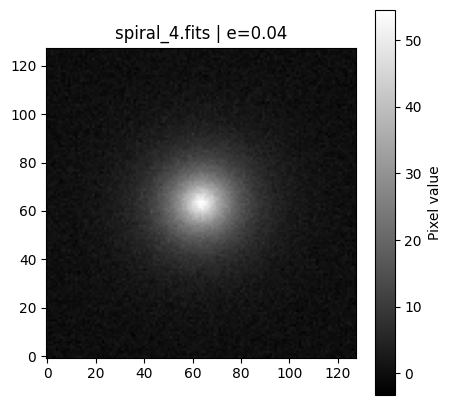
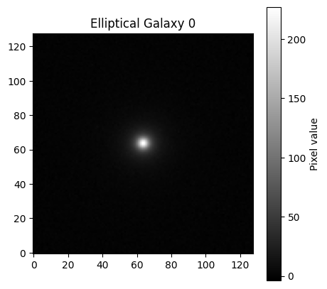
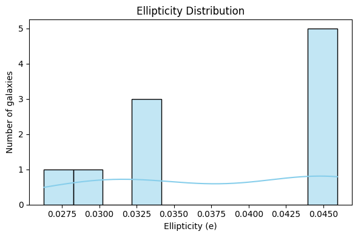

## Plots

The `plots/` folder contains visualizations generated from the simulated galaxies and shape measurements.

- **Example Galaxy Images:**  
  -   
  - 

- **Shape Analysis Visualizations:**  
  -  – distribution of galaxy ellipticities  
  -  – scatter plot of shear components  

**Notes:**  
- All images are generated using the provided Colab notebook.  
- These plots illustrate the effects of PSF, noise, and weak lensing shear on galaxy shapes.
